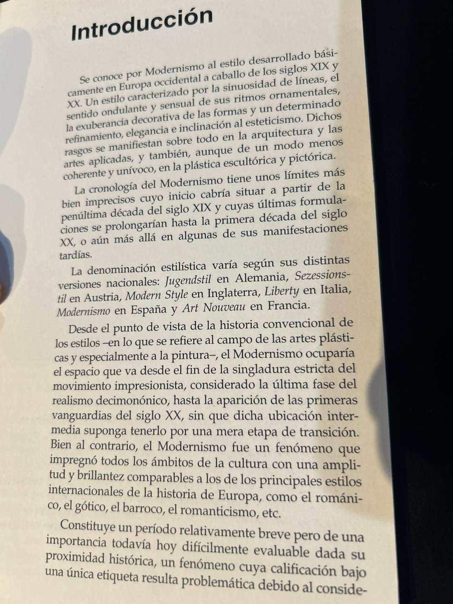
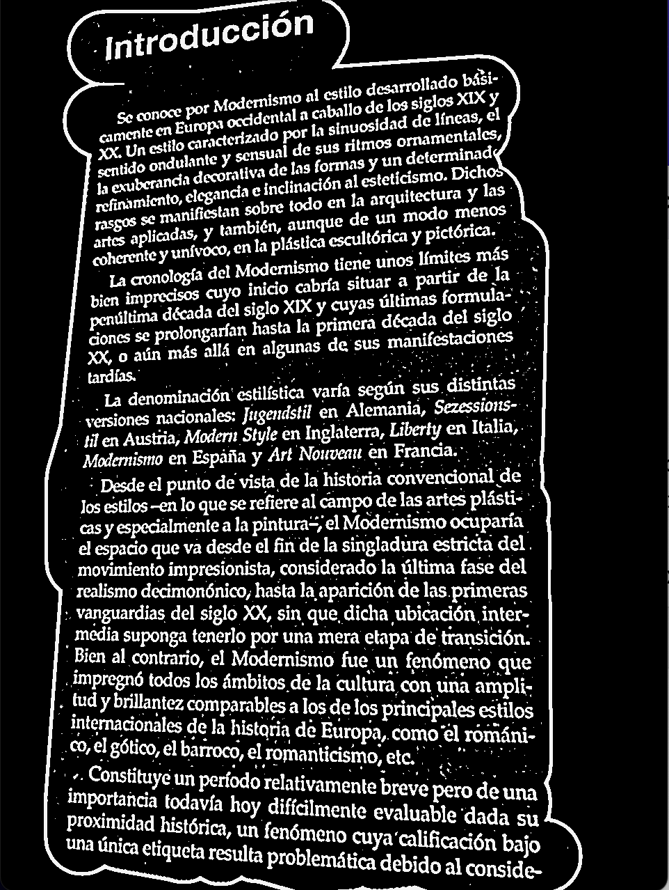
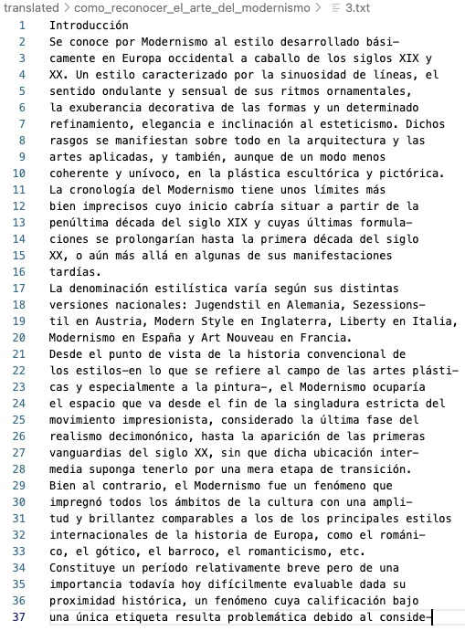

# BrushOCR: Image to Text Extractor with Brush Selection

  

<div style="display: flex; justify-content: center; gap: 20px;margin-bottom:2rem;">
    
    
    
</div>

**BrushOCR** is a lightweight tool that extracts text from the image.
It provides two methods for text extraction:
1. **Direct OCR** – Extracts text from the whole image or folder. (Tesseract/Google Cloud)
2. **Brush OCR** – Allows users to highlight specific areas for text recognition. (Tesseract only)

## Features
- **Image Preprocessing (OpenCV)**
  - Image undergoes some preprocessing steps in order to improve text extraction.
- **Manual Brush Selection**.
  - Allows users to highlight specific regions of an image for targeted text extraction.
	- Ideal for extracting text from paragraphs, titles, or captions.
- **OCR Engines for Text Extraction**
  - **Tesseract OCR**
	  - Open-source OCR engine supporting multiple languages.
	  - Has medium accuracy.
	  -	Works offline.
    - Free.
  - **Google Cloud Vision API**
  	- Advanced text recognition with support for multiple languages and handwriting.
    - Provides high-accuracy text extraction and translation.
  	- Requires internet connection and API key.
  	- For a fee. First 1000 units/month are free. [See Pricing](https://cloud.google.com/vision/pricing)


## Installation
1. Install Python 3.11

Windows: Download and install Python 3.11 from the official Python website.

MacOS: Use Homebrew to install Python 3.11:
```
brew install python@3.11
```
Linux: Use your package manager to install Python 3.11. For example, on Ubuntu:
```
sudo apt-get update
sudo apt-get install python3.11
```
Verify the installation:
```
  python3.11 --version
```
2. Install Dependencies
  ```
    pip install -r requirements.txt
  ```
3. Set Up Environment File
  * Create a .env file in the root directory of the project.
  * Add your Google Cloud Vision API Key to the .env file:
  ```
    GOOGLE_API_KEY=your_api_key_here
  ```


## Usage
* Brush Selection OCR
Run the script to highlight text regions and extract text from provided image:
```
  python3.11 brush_ocr.py --image_path lib/first_page.jpeg
```
* Directory Processing
Process all images in provided directory and save extracted text:
```
  python3.11 direct_ocr.py --image_dir resources/como_reconocer_el_arte_del_modernismo
```
In order to use Google Cloud Vision pass ```--use_google_vision```

License
This project is licensed under the MIT License. See the LICENSE file for details.

## Additional Script
The ```remaining_google_quota.py``` script allows you to check the remaining quota usage for the Google Cloud Vision API. This is useful for monitoring your API usage and ensuring you stay within the free tier limits.

Ensure you have set up the .env file with your ```GOOGLE_API_KEY, GOOGLE_CRED_PATH and PROJECT_ID```.

Run the script:
```
python3.11 remaining_google_quota.py
```
Output example:
```
Total API requests in the last 30 days: 45
Total quota used in the last 30 days: 0 units
You are within the free tier limit. Units used: 0/1000
```