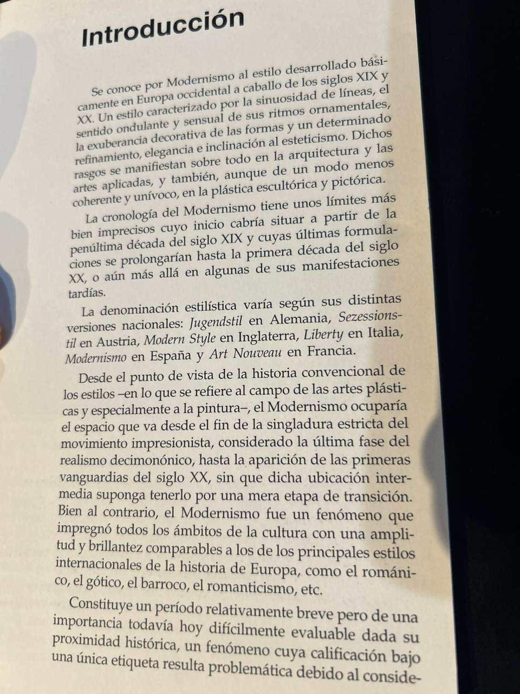
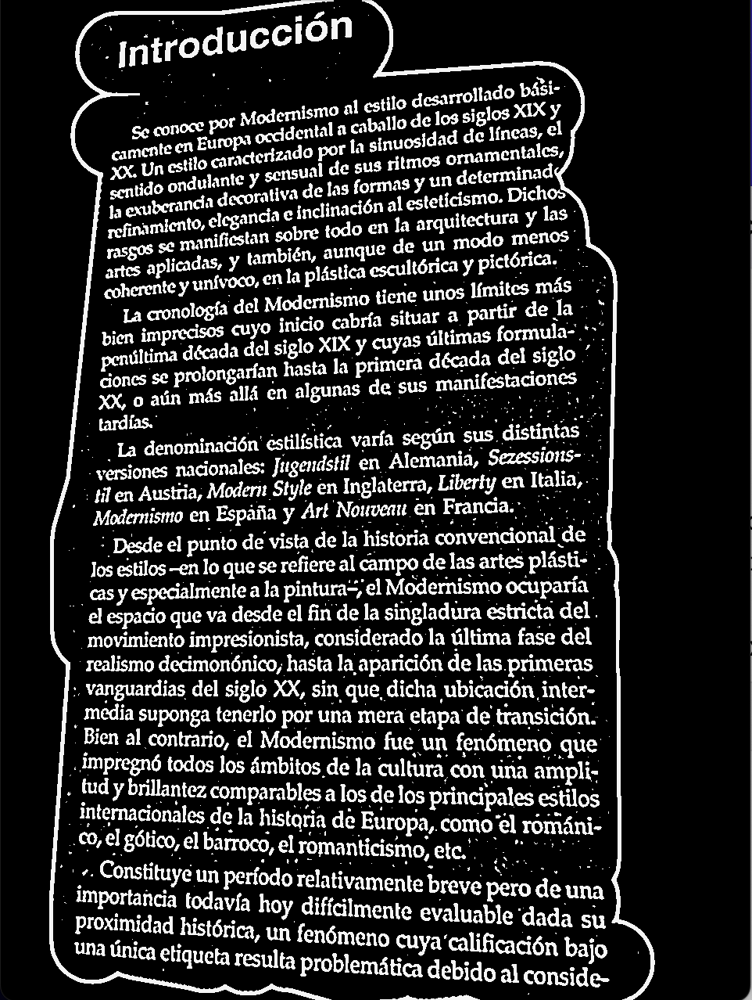

# BrushOCR: Image to Text Extractor with Brush Selection

  

    
    

**BrushOCR** is a lightweight tool that extracts text from images using OCR. It provides two methods for text extraction:
1. **Direct OCR** – Extracts text from the whole image.
2. **Brush Selection OCR** – Allows users to highlight specific areas for text recognition.

## Features
- Opens and Preprocesses image with **OpenCV**. 
  - Write here how image is preprocessed and optimized for better text extraction.
- Uses **NumPy** for efficient matrix operations.
- Supports **manual brush selection** to refine text recognition.
  - User can select appropriate text field with mouse. It can be certain paragraph or whole text to make parsing process more accurate. 
- Extracts text from images using **Tesseract OCR**.
  - Tesseract OCR is an open-source OCR engine developed by Google. It is one of the most powerful and widely used OCR tools, supporting multiple languages and advanced text recognition techniques.